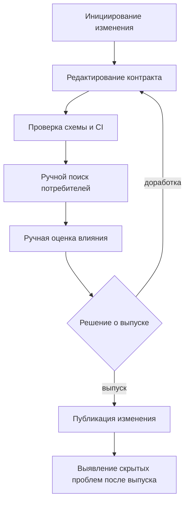

# Бизнес-процесс AS-IS: выпуск изменения без consumer-aware протокола

## Статус и назначение

AS-IS является аналитической базовой моделью, а не результатом обследования конкретной организации. Она описывает воспроизводимый процесс сравнения, в котором домен-производитель использует техническую проверку схемы, а семантические зависимости и влияние на потребителей выявляются вручную.

Модель нужна для трех задач:

- отделить техническую совместимость от семантической;
- определить операции, которые должен изменить процесс TO-BE;
- задать наблюдаемые показатели для последующей организационно-экономической оценки.

## Границы процесса

Начало процесса - у команды-производителя сформирована потребность изменить контракт продукта данных.

Окончание процесса - изменение выпущено, возвращено на доработку либо остановлено. Если несовместимость не была выявлена до выпуска, процесс продолжается обнаружением и разбором инцидента у потребителя.

Входы:

- действующая версия контракта;
- предлагаемая версия контракта;
- техническая схема;
- доступные сведения о потребителях и зависимостях;
- локальные правила команд и общие организационные политики.

Выходы:

- решение о выпуске или доработке;
- новая версия контракта при выпуске;
- разрозненные согласования и результаты проверок;
- при ошибке - запись об инциденте и корректирующие действия.

## Последовательность AS-IS

| Шаг | Исполнитель | Действие | Основной результат | Риск или потеря |
|---|---|---|---|---|
| A1 | Владелец продукта данных | Формулирует потребность в изменении | Описание изменения | Бизнес-смысл может быть зафиксирован неполно |
| A2 | Команда-производитель | Изменяет схему и документацию контракта | Новая версия-кандидат | Семантическое изменение может не отражаться в типе или имени поля |
| A3 | CI/CD или Schema Registry | Проверяет структурную совместимость | Технический результат проверки | Технически совместимое изменение ошибочно воспринимается как безопасное |
| A4 | Производитель или платформенная команда | Ищет активных потребителей и зависимости | Список предполагаемых участников | Реестр может быть неполным или неактуальным |
| A5 | Команды-потребители | Вручную анализируют влияние на свои расчеты и процессы | Комментарии и локальные решения | Результаты имеют разный формат и могут быть нетрассируемыми |
| A6 | Производитель, потребители или центральная функция | Согласуют итоговое решение | Выпуск, блокировка или доработка | Неочевидны приоритеты конфликтующих требований и полномочия участников |
| A7 | Производитель | Публикует изменение | Новая версия продукта данных | Необнаруженная несовместимость попадает к потребителям |
| A8 | Потребитель и эксплуатация | Обнаруживают и устраняют последствия | Инцидент, откат, миграция или исправление | Ошибка обнаруживается после использования данных |

## Узкие места

1. Сведения о зависимостях и требованиях могут храниться в разных системах или в неформальных договоренностях.
2. Структурная проверка не обнаруживает изменение единицы, формулы, временного окна, области идентификатора, происхождения или назначения данных.
3. Для одинаковых изменений команды могут применять разные процедуры и критерии.
4. Конфликт требований не имеет заранее заданного правила безопасной финализации.
5. Центральная команда становится посредником в вопросах, смысл которых принадлежит доменам.
6. История решения может не связывать версию контракта, участников, требования и основания допуска.

## Наблюдаемые показатели AS-IS

| Показатель | Что измеряет | Статус в текущем исследовании |
|---|---|---|
| Длительность проверки изменения | Время от создания версии-кандидата до решения | Требует процессного пилота или сценарной оценки |
| Количество ручных взаимодействий | Число запросов, согласований и эскалаций | Требует фиксации процедуры пилота |
| Доля обнаруженных до выпуска опасных изменений | Способность процесса предотвращать скрытые несовместимости | Технический прокси оценивается через V1-ind в E3 |
| Доля ложных блокировок | Потери скорости из-за избыточного контроля | Технический прокси оценивается в E3 |
| Доля решений без воспроизводимого обоснования | Качество трассируемости | Требует отдельной процессной оценки |
| Инциденты после выпуска | Остаточный риск процесса | Не измеряется на реальной организации в рамках текущей ВКР |

## Ограничения базовой модели

AS-IS не утверждает, что все организации работают одинаково или что ручное согласование всегда неэффективно. Модель используется только как прозрачная точка сравнения с TO-BE. Реальные роли, длительность, стоимость операций и частота инцидентов должны уточняться при организационном пилоте.
