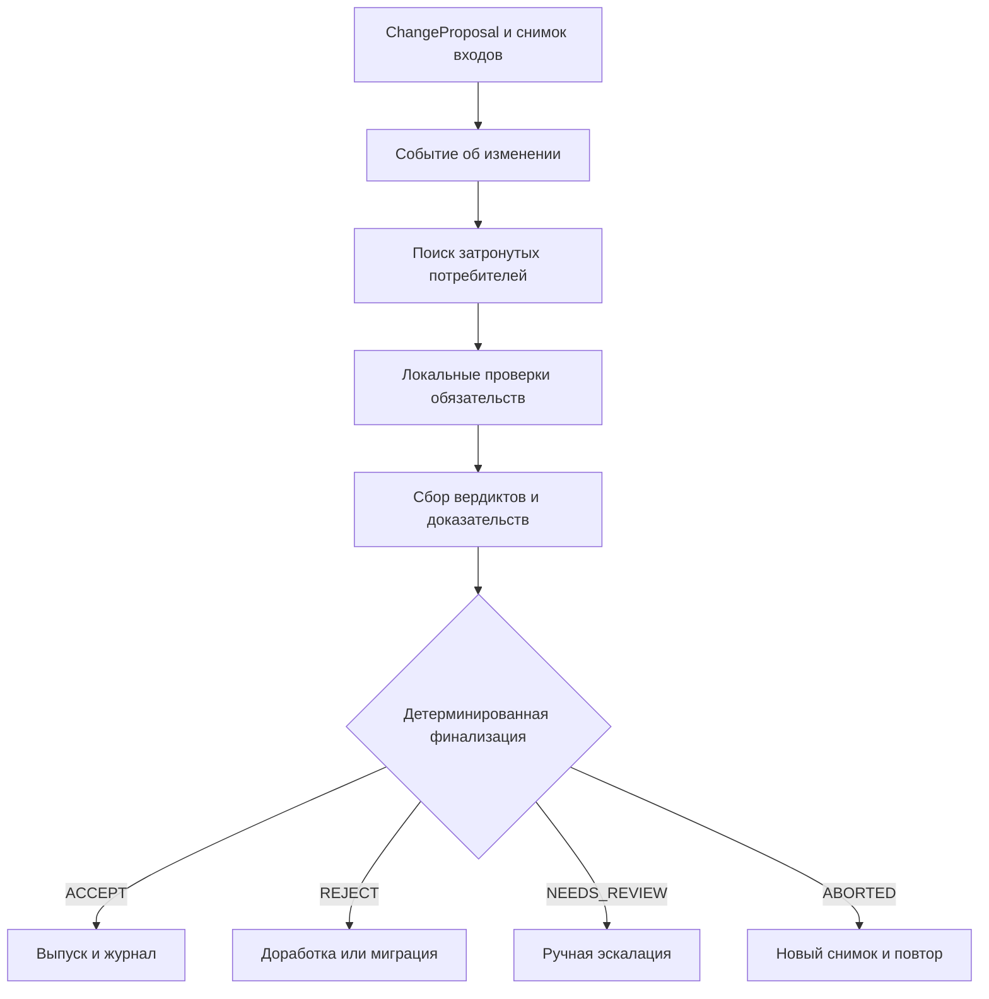

# Бизнес-процесс TO-BE: выпуск изменения с consumer-aware протоколом

## Цель процесса

TO-BE переносит проверку семантической совместимости до публикации изменения и распределяет действия между автономными доменами. Платформенный уровень обеспечивает транспорт, форматы, наблюдаемость и детерминированную финализацию, но не присваивает себе локальный бизнес-смысл данных.

Начало процесса - владелец продукта данных зарегистрировал `ChangeProposal` со ссылками на неизменяемые версии старого и нового контрактов.

Окончание процесса - сформировано и сохранено итоговое решение, после которого изменение опубликовано, возвращено на доработку, направлено на ручную проверку либо перезапущено на новом снимке.

## Последовательность TO-BE

| Шаг | Исполнитель | Действие | Контрольный артефакт | Возможный исход |
|---|---|---|---|---|
| T1 | Владелец продукта данных | Формирует `ChangeProposal` и новую версию контракта | `proposal_id`, старый и новый снимки, версия конституции | Регистрация или отклонение невалидного предложения |
| T2 | Доменный узел производителя | Публикует событие об изменении | Неизменяемое событие и `run_id` | Начало проверки на зафиксированном снимке |
| T3 | Сервис обнаружения | Определяет активных потребителей и версии их обязательств | `snapshot_id`, реестр потребителей и `ConsumerObligation` | Полный список либо безопасная эскалация при неполноте |
| T4 | Доменные узлы потребителей | Проверяют изменение по локальным обязательствам и конституциям | `LocalVerdict`, коды причин, затронутые поля, доказательства | `ACCEPT`, `REJECT` или `NEEDS_REVIEW` по каждому потребителю |
| T5 | Координатор протокола | Собирает ответы, контролирует версии, повторы и тайм-ауты | Набор вердиктов с версиями входов | Готовность к финализации либо безопасный отказ |
| T6 | Детерминированный Policy Engine | Применяет приоритет `REJECT > NEEDS_REVIEW > ACCEPT` и правила снимка | `ReleaseDecision` и воспроизводимая трасса | Итоговое решение |
| T7 | Производитель | Исполняет итог | Новая версия, исправленное предложение или заявка на рассмотрение | Выпуск, доработка или эскалация |
| T8 | Платформа и домены | Сохраняют журнал и наблюдают последствия | Связь предложения, вердиктов, решения и выпуска | Аудит и вход для последующего анализа |

## Правила итогового решения

| Состояние | Действие процесса |
|---|---|
| Все обязательные проверки дали `ACCEPT`, снимок входов не изменился | Разрешить выпуск в пределах полномочий домена |
| Хотя бы одно обязательное правило нарушено | Сформировать `REJECT`; предложить доработку, миграцию или отдельную версию |
| Недостаточно данных, есть устранимый конфликт или требуется неформализованное решение | Сформировать `NEEDS_REVIEW`; передать человеку полный контекст и трассу |
| Изменился входной снимок, устарела версия или нарушена целостность запуска | Сформировать `ABORTED`; повторить проверку на новом снимке |
| Тайм-аут или техническая ошибка не позволяют подтвердить безопасность | Не преобразовывать неопределенность в `ACCEPT`; применить `NEEDS_REVIEW` или безопасное завершение по конституции |

## Что автоматизируется и что остается человеку

Автоматизируются:

- сопоставление изменения с зарегистрированными потребителями;
- проверка формализованных семантических обязательств;
- контроль версий, полноты, повторов и целостности снимка;
- детерминированная финализация;
- сохранение причин и доказательств.

За человеком и организацией остаются:

- определение бизнес-смысла данных и границ домена;
- назначение владельцев и полномочий;
- утверждение новых типов правил и обязательств;
- разрешение неформализованных конфликтов;
- принятие риска в случаях, где это прямо допускается конституцией;
- решение о пилоте, внедрении и масштабировании.

## Изменение процесса относительно AS-IS

| Область | AS-IS | TO-BE | Проверяемый эффект |
|---|---|---|---|
| Поиск зависимостей | Ручной и потенциально неполный | Версионированный реестр активных потребителей | Полнота охвата и доля безопасных эскалаций |
| Проверка смысла | Неформальная или набор разрозненных правил | Типизированные `ConsumerObligation` и общий интерпретатор V2 | Опасные допуски и ложные блокировки в E3 |
| Согласование | Сообщения и ручное сведение мнений | Локальные вердикты и детерминированная финализация | Воспроизводимость решения в E4 |
| Неопределенность | Может быть неявно принята как разрешение | Явный `NEEDS_REVIEW` или `ABORTED` | Доля ручных вмешательств и безопасных отказов |
| Аудит | Разрозненные свидетельства | Связанная трасса версий, обязательств, вердиктов и решения | Полнота и воспроизводимость трассы |
| Организационная модель | Центральная функция может стать арбитром смысла | Смысл остается у доменов, платформа исполняет общий протокол | Доля решений без центрального семантического разрешения |

## Условия применимости

TO-BE применим, если в организации определены владельцы продуктов данных, ведется версионирование контрактов, зарегистрированы активные потребители и формализована хотя бы обязательная часть их требований. Протокол не компенсирует отсутствие владения, неизвестные зависимости и неописанный бизнес-смысл; он должен переводить такую неопределенность в безопасную эскалацию.

## Границы доказательства

E3 может подтвердить качество детерминированных решений на зафиксированном каталоге, но не доказывает сокращение длительности реального согласования. E4 должен отдельно проверить локальные полномочия, асинхронное взаимодействие, сбои и воспроизводимость. Фактические трудозатраты, стоимость процесса и экономический эффект определяются в последующей модели и организационном пилоте.
