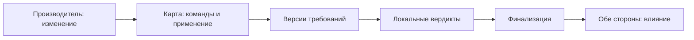

# Пакет для встречи с Александром Дубовицким

Черновик 27.09.2026. Цель - получить методологическую обратную связь; текст не является утверждённой формулировкой ВКР.

## Постановка за одну минуту

Несколько автономных команд Data Mesh используют один продукт данных, но предъявляют разные требования к смыслу его атрибутов. Производитель меняет бизнес-правило вычисления признака, сохранив его имя и тип. Структурная проверка проходит, хотя отчёт одного из потребителей меняет смысл. Задача - **до выпуска** сопоставить описание изменения с версионированными и подтверждёнными обязательствами затронутых потребителей и вынести объяснимый вердикт.

Пример: "активный клиент" прежде означал использование ресурса за 30 дней; новая версия дополнительно требует положительного баланса. Маркетинг рассчитывает удержание по старому определению, биллинг использует новое. Тип поля остаётся boolean. Производитель должен увидеть затронутые команды и их требования до выпуска. Для каждой команды требуется собственное основание, а итоговый допуск не может игнорировать обязательное нарушение.

## Проверяемый механизм и карта контекста

Карта - рабочая часть V2, а не самостоятельное заявление о новизне. Она помогает производителю увидеть, кого затронет изменение до выпуска, а потребителю - понять изменение используемых данных и проверить своё обязательство. Общий поиск допустим; право утверждать смысл продукта, требования и локальный вердикт остаётся у соответствующих доменов. Технологию хранения, включая графовую БД, выбираем после фиксации операций и объёма данных.

Минимальная цепочка записей: домен и команда-владелец -> продукт и версия контракта -> атрибут и определение -> потребляющая команда и активное использование -> назначение использования и зависимый расчёт -> версия подтверждённого требования -> полномочие и источник подтверждения. Общие федеративные инварианты имеют отдельного владельца. Для каждой связи нужны происхождение, актуальность и статус; агент может предложить связь, но не утверждает её за команду. Производитель подтверждает описание выпуска, потребитель - использование и своё требование.

1. Производитель подаёт ChangeProposal со старой и новой версиями контракта, смыслом изменения и предполагаемой датой действия.
2. Карта выбирает активные зависимости и версии требований по фиксированному снимку. Неподтверждённая или отсутствующая запись не подменяется догадкой агента. Полнота охвата оценивается отдельно: известны ли все обязательные потребители в заданных границах наблюдаемости.
3. Локальные контуры проверяют применимые требования и формируют LocalVerdict с причиной, доказательством и версией. Агент может собрать контекст и предложить объяснение; Policy Engine исполняет формальные правила.
4. Детерминированная финализация на том же снимке выдаёт ACCEPT, если все обязательные проверки известны и выполнены; REJECT при доказанном нарушении; NEEDS_REVIEW при неразрешённом пробеле, конфликте или отсутствии ответа. Повтор сообщения не создаёт второго выпуска. Человек может подтвердить недостающий факт или изменить требование в пределах полномочий; решение затем пересчитывается по новой версии.
5. Производитель получает перечень затронутых команд, требований и причин. Потребитель видит изменённое определение, потенциально затронутый расчёт, версию, дату и ответственного. Уведомление и статус согласования не заменяют локального вердикта.

Пример "активного клиента": признак остаётся boolean, но к условию активности за 30 дней добавляется положительный баланс. Карта показывает маркетинг с метрикой удержания по прежнему определению и биллинг с иным назначением. V2 проверяет соответствующие подтверждённые требования и объясняет, чья метрика меняется; она не выводит требование маркетинга из названия поля.

Схема для обсуждения:

Граница проверки: H1 оценивает качество решений о выпуске при заданной и подтверждённой карте; отдельно проверяем, когда неполнота карты приводит к NEEDS_REVIEW. Автоматическое обнаружение всех неизвестных потребителей, сокращение стоимости и времени изменений, экономия токенов и эффект интерфейса для команд не входят в подтверждение H1.

## Проверяемые положения

**H1 (основная).** На заранее зафиксированном каталоге семантических изменений V2, учитывающая подтверждённые обязательства затронутых потребителей, уменьшит долю опасных изменений, ошибочно допущенных к выпуску, относительно V1-ind без чрезмерной доли ложных блокировок и NEEDS_REVIEW. Текущие критерии в документе: разница в доле опасных допусков не менее 0,15; отсутствие парных регрессий V2 на опасных сценариях; false_block_rate и needs_review_rate не более 0,10. Просим оценить обоснование порогов и границу выводов для синтетического каталога.

| Вариант | Доступный контекст | Роль |
| --- | --- | --- |
| V0 | Типы и структура | Нижний структурный ориентир |
| V1-ind | Общий контракт и замороженные общие правила, без адресных обязательств всех потребителей | Основной baseline |
| V2 | То же изменение плюс подтверждённые связи и требования конкретных затронутых команд | Предлагаемый механизм |

**H2 (отложена).** Организационная трудоёмкость и время вывода изменений требуют отдельного исследования с участниками; E2 исключён. Ни экономию, ни снижение токенов в H1 не включаем.

**H3 (предлагается к методологической оценке).** При фиксированных версиях контрактов и полном составе обязательных потребителей распределённое исполнение сохраняет решение локального эталона при повторной доставке и перестановке сообщений; отсутствие обязательного ответа не разрешает выпуск. Дополнительная проверка: при доступных участниках и заданных задержках решение завершается до установленного TTL. В текущем тексте ВКР E4 описана как архитектурная оценка; статус H3 и метод проверки пока предлагаются к обсуждению.

**V1-oracle - переходное расхождение.** По последнему решению сравниваем V0, V1-ind, V2; V1-oracle не нужен для H1 и не включён в предлагаемый основной эксперимент. В текущей ВКР и коде он ещё присутствует вместе с H1b/E3-S. До правок сверить зависимости и затем согласованно убрать либо сохранить лишь при доказанной независимой роли.

## Гипотезы, эксперименты и данные для обсуждения

| Положение | Сравнение и единица | Данные и эталон | Проверка и граница вывода |
| --- | --- | --- | --- |
| H1 - качество выявления опасных семантических изменений | Парные решения V2 против V1-ind на одном сценарии изменения; V0 - структурный ориентир | Старый/новый контракт, описание изменения, зафиксированный снимок карты, подтверждённые требования, независимая метка опасности/допустимости, семейство сценария | E3: разница долей опасных ACCEPT не менее 0,15; отсутствие парных регрессий; false_block_rate и needs_review_rate не выше 0,10. Публикуем все исходы и неопределённость; вывод только для проверенного каталога |
| H2 - трудоёмкость и срок изменений | В текущую программу не входит | Нужны наблюдения за людьми и процессом в организации | Отложено; демонстрация карты не доказывает экономию |
| H3 - корректность распределённого выпуска (предложение) | Повторы, перестановка, отсутствие обязательного узла против локального эталона на одном снимке; единица - сценарий доставки и финализации | Версии контрактов, состав обязательных участников, подписанные LocalVerdict, порядок/время сообщений, ожидаемый локальный итог, журнал выпуска | E4: совпадение финального решения при полной доставке, идемпотентность, независимость от порядка, отсутствие ложного ACCEPT при пропаже обязательного ответа; завершение до TTL при заданных задержках. Вывод только для испытанной топологии |
| Роль карты в V2 - диагностический вопрос | Полная, устаревшая и неполная карта при одинаковом изменении; не новая основная гипотеза | Источник и статус связей, версии, подтверждения владельцев, известный состав потребителей | Проверяем полноту обнаружения затронутых требований и безопасную неопределённость. Отделяем качество карты от качества интерпретатора |

Текущая ВКР содержит 20 development и 40 evaluation-сценариев в шести семействах, три логически автономных домена, два адаптера и три конфигурационных профиля E4. До E3 требуются внешний review реалистичности и эталонной разметки, зафиксированные критерии и раздельные входы валидатора и scoring. Цель поиска - около 10 экспертов разных ролей; их оценки вложены в экспертов и сценарии, поэтому анализируем согласие и расхождения по ролям, не выдавая 800 отметок за 800 независимых людей. Объём "2 x 40" проверяем пилотом на нагрузку. Числовые пороги H1 сейчас сохраняем из ВКР; пересмотр допустим до основного прогона с новой версией протокола.

### Что показать Дубовицкому

- Один сквозной сценарий: версия смысла "активного клиента", два потребителя с различными требованиями, ожидаемые результаты V0/V1-ind/V2 и трасса решения.
- Схема полномочий: кто подтверждает контракт, использование, требование и локальный вердикт; что делает общий поисковый слой и где требуется человек.
- Матрица входов режимов и правила UNKNOWN; каталог семейств F1-F6, распределение опасных/допустимых изменений и протокол экспертной разметки.
- Проект H1/H3 с метриками, порогами и ограничениями; календарь E3/E4 и доступные ресурсы.
- Краткая матрица ближайших аналогов с подтверждёнными источниками; отдельно проверить отраслевой пример Booking.com перед цитированием. Карту как новую идею не заявлять.

## Вопросы к обсуждению

1. Достаточно ли узко сформулированы объект, предмет, проверяемый вклад и H1 для магистерской ВКР?
2. Имеет ли H3 научно проверяемый смысл или корректнее оставить E4 архитектурной оценкой? Какой локальный эталон и набор сбоев достаточны?
3. Как обосновать текущие пороги H1 до основного прогона и как ограничить вывод на синтетических сценариях?
4. Дает ли V1-oracle полезный отдельный контроль после сверки его реализации с V2?
5. Можно ли сохранить утверждённую тему с узкой постановкой во введении либо разумно согласовать уточнение названия? Тему самостоятельно не меняем.
6. Насколько достаточна независимая экспертная разметка сценариев, как обрабатывать несогласие и сколько оценок разумно запросить с одного эксперта?
7. Является ли предполагаемый вклад научным в пределах формальной модели и детерминированного протокола, с учётом уже известных контрактов, каталогов и федеративного governance? Требуется отдельная проверка ближайших аналогов, без заявления абсолютной новизны.

## Для устного объяснения

"Мы изучаем выпуск изменения смысла данных, которое не видно по типу поля. Производитель узнаёт из подтверждённой карты, какие команды зависят от продукта и какие требования они закрепили. V2 проверяет изменение по каждому применимому требованию и даёт объяснимое решение. Основной эксперимент сравнит её с честным baseline по опасным допускам, ложным блокировкам и ручному разбору. Отдельно хотим проверить поведение распределённого протокола при повторах сообщений и отказе обязательного участника."
