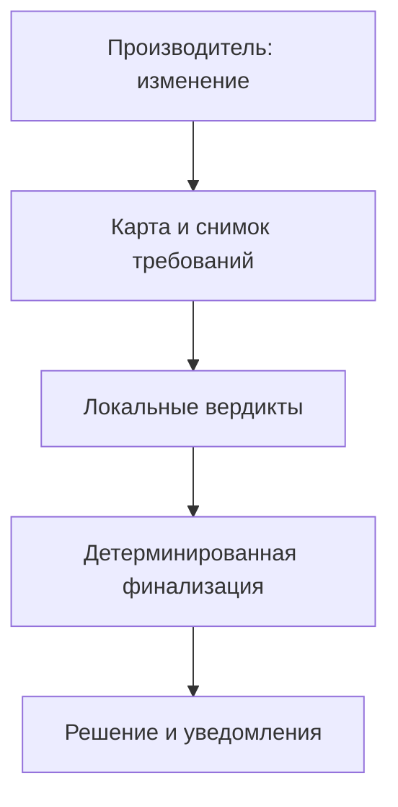

# ВКР: материал для методологического обсуждения с Александром Дубовицким

Рабочая версия 29.09.2026. Это постановка для обсуждения, а не утверждение о доказанной новизне или проведённом эксперименте. Официальное название ВКР пока не меняем: "Проектирование событийно-ориентированной архитектуры управления кросс-платформенными метаданными пользователей на принципах децентрализации (Data Mesh)".

## 1. Проблема на одном примере

Продукт данных публикует признак "активный клиент". Производитель меняет его определение: к активности за последние 30 дней добавляет условие положительного баланса. Название и тип boolean остаются прежними. Биллинг использует новое определение, а маркетинг строит ряд удержания по старому. Проверка схемы проходит; применимость изменения зависит от требований конкретных потребителей.

Задача производителя - выпустить изменение, не нарушив подтверждённые обязательства активных потребителей. Задача потребителя - до перехода увидеть, что меняется в используемых им данных, и дать локальный вердикт по своему требованию. Неизвестный смысл не угадывается языковой моделью.

## 2. Объект, предмет, цель и граница

| Элемент | Рабочая формулировка | Что исключено |
| --- | --- | --- |
| Объект | Децентрализованное управление метаданными междоменных продуктов пользовательских данных при независимом развитии доменов | Полное организационное внедрение Data Mesh |
| Предмет | Формальная модель и событийный протокол допуска семантического изменения по версионированным требованиям затронутых потребителей; свойства качества решения и распределённого исполнения | Автоматическое познание любого бизнес-смысла |
| Цель | Разработать и оценить consumer-aware протокол V2 с подтверждённой картой зависимостей, локальными вердиктами и детерминированной финализацией без центрального семантического арбитра | Обещание экономии, готовности к промышленной эксплуатации |
| Единица H1 | Одно предложение заменить старую версию контракта новой при фиксированном снимке активных потребителей и требований | Отдельный запуск валидатора как независимое наблюдение |
| Единица H3 | Один сценарий доставки, сбоя и финализации на зафиксированных версиях и составе участников | Число сервисов как доказательство децентрализации |

Официальная тема шире фактического исследовательского ядра. Нужно решить с Дубовицким, достаточно ли сузить объект и предмет во введении или требуется официальное уточнение названия.

## 3. Что делает V2

1. Производитель создаёт `ChangeProposal`: старый и новый контракт, описание изменения, версии, предполагаемое вступление в силу.
2. Модуль знаний по фиксированному снимку возвращает зарегистрированные активные зависимости, применимые требования и ответственные домены. Каждая запись имеет источник, подтверждение, версию и срок актуальности.
3. Каждый затронутый домен проверяет изменение относительно своих `ConsumerObligation` и формирует `LocalVerdict` с причиной и доказательством. Агент может предложить связь или объяснение, но не утверждает новое требование за команду и не отменяет запрет.
4. Policy Engine собирает обязательные ответы и детерминированно формирует `ReleaseDecision`. Нарушение даёт REJECT; недостаток подтверждённого контекста, конфликт или отсутствие обязательного ответа - NEEDS_REVIEW; ACCEPT возможен только при полноте обязательных положительных проверок на неизменном снимке. Смена снимка требует повторной проверки.
5. Производитель видит затронутые команды, требования и причины; потребитель - новое определение, используемые расчёты, версию, время перехода, ответственного и статус. Уведомление не заменяет LocalVerdict.

## 4. Базовая карта: что потребуется

Карта - рабочий модуль V2 для контекста и поиска применимых обязательств, а не заявка на новый тип базы знаний. Технология хранения (графовая, реляционная, событийные проекции) выбирается после определения запросов и требований к версиям.

| Запись или связь | Минимальные поля | Кто подтверждает | Зачем нужна |
| --- | --- | --- | --- |
| Домен, команда, полномочие | ID, роль, область ответственности, версия правил | Уполномоченный владелец домена/федеративная функция в пределах своих прав | Маршрутизация и проверка права выдавать вердикт |
| Продукт и контракт | Владелец, версия, атрибут, тип, определение, формула, время действия | Производитель | Установить, что именно меняется |
| Активное потребление | Потребитель, продукт/атрибут, назначение, зависимый расчёт, активность | Потребитель подтверждает использование | Выбрать затронутые команды и показать влияние |
| Обязательство | Поле, семантическое правило, версия, обязательность, срок, владелец | Потребитель | Проверить изменение адресно |
| Федеративный инвариант | Версия правила, область действия, приоритет, владелец | Федеративная функция | Не допустить обхода общих запретов |
| Происхождение и состояние | Источник, доказательство, `confirmed/candidate/stale`, момент актуальности | Владелец записи | Не считать догадку агента подтверждённым требованием |
| Снимок и решение | `snapshot_id`, версии записей, ответы, коды причин | Протокол фиксирует; домены подписывают свои позиции | Воспроизвести решение и обнаружить устаревший контекст |

Общий индекс и интерфейс удобны командам; **управление остаётся децентрализованным**: производитель владеет контрактом, потребитель - использованием и обязательством, федеративная функция - общими инвариантами. Индекс не меняет записи за владельца и не голосует вместо домена. Потребитель, о существовании которого нет сведений вне определённой границы регистрации, не может быть магически найден: полноту нужно ограничить и проверять. Кандидат связи от агента остаётся неактивным до подтверждения.

Реализован модуль knowledge-1: типизированные записи, история версий, подтверждение и отзыв, поиск влияния, снимки с контролем полноты, полный путь V2, CLI и API с доменными полномочиями. Прямые обязательства в сценарии сохраняются только в экспериментальном ядре. Межпроцессный обмен проверен локально в пакете 2; облачный E4 не проведён. [Подробная карта, связи, таблицы достаточности и операции](knowledge-module-2026-09-29.md) являются частью этого пакета.

### Контур карты, который обсуждаем

| Слой | Содержание | Что даёт для решения |
| --- | --- | --- |
| Ответственность | Домены, команды, доверенные полномочия производителя/потребителя/регистратора | Кто может подтвердить знание; агент не выдаёт себе право |
| Определение продукта | Текущий контракт, атрибуты, версия и источники определения | С чем сравнивается предложение изменения |
| Потребление | Активные использования, поля, назначение, зависимый расчёт, команда | Кого затрагивает изменение |
| Ограничения | Одно или несколько типизированных обязательств каждого потребителя; федеративные правила | Какие условия проверяет V2 |
| Граница полноты | Подтверждённый Coverage, membership_epoch и граница регистрации | Почему отсутствие найденной связи не означает отсутствие потребителя |
| Фиксация | Неизменяемый снимок контрактов и версий; хеши и issues | На каком контексте получено решение |
| Выпуск | Проверки, повторная проверка актуальности, состояние и release_id | Действительное нарушение - REJECT; пробел - NEEDS_REVIEW; изменившийся контекст - ABORTED |
| Объяснение | Для производителя - команды/причины; для потребителя - поле/требование/изменение | Возможность проверить решение и дополнить сведения |

Для ACCEPT нужны подтверждённая граница, согласованные действующие записи и все положительные обязательные проверки. Для REJECT нужно конкретное действительное нарушение; при неясном происхождении требования нельзя выдавать его за доказательство. После отзыва или изменения состава старый запуск не разрешает выпуск. Пустой подтверждённый состав потребителей и отсутствующий реестр различаются.

В текущем ядре профиль семантики относится к продукту целиком; атрибуты карты уточняют использование. Ссылки на зависимый расчёт не означают автоматическую проверку его кода. Смена владельца, отдельные профили для каждого поля и восстановление публикации после падения координатора требуют отдельного расширения. Это границы заявленного механизма, которые следует подтвердить методологически.

### Данные для обсуждения и эксперимента

| Проверяемый аспект | Требуемые данные | Как проверяется |
| --- | --- | --- |
| Семантическая совместимость H1 | Контракты до/после, миграции, подтверждённые требования, независимый эталон | Парные V1-ind/V2; строгие пороги без подгонки |
| Достаточность карты | Coverage, Usage, Obligation, статусы, сроки, версии и полномочия | Отдельные негативные случаи; без смешения с качеством H1 |
| Корректность фиксации | Журнал, снимки, хеши, отзыв/истечение до commit | Воспроизводимость; ABORTED и отсутствие release_id |
| Экспертная валидность | Независимые ответы, роль, причины, реалистичность, расхождения | Слепая анкета, согласование до freeze |
| Распределённые свойства H3 | Независимые процессы, события, seed, задержки, TTL, журнал выпусков | E4 по 12 классам пройден локально; облачный запуск впереди |

## 5. Сравнение режимов

| Вопрос | V0 | V1-ind | V2 |
| --- | --- | --- | --- |
| Структура и типы | Да | Да | Да |
| Общая policy-матрица и явные миграции | Нет | Да | Не наследует автоматически все запреты V1-ind |
| Адресные подтверждённые требования | Нет | Нет | Да, из фиксированного снимка карты |
| Изменение формулы при прежнем типе | Обычно пропускает | Реагирует, только если охвачено общим правилом | Проверяет требования затронутых потребителей |
| Роль в E3 | Нижний ориентир | Основной baseline | Исследуемый механизм |

`V1-oracle` исключён как режим. **Отдельный scoring oracle остаётся**: это экспертно проверенные ожидаемые решения, недоступные V0/V1-ind/V2 до завершения raw run. Так не смешиваются контрольная разметка и конкурирующая реализация тех же правил.

## 6. Гипотезы, данные и проверка

| Положение | Данные и метод | Критерий и ограничение |
| --- | --- | --- |
| H1: V2 уменьшает долю опасных допусков относительно V1-ind без избыточных ложных блокировок и NEEDS_REVIEW | Парный E3 на одном заранее зафиксированном каталоге: 20 development для настройки, 40 закрытых evaluation (20 опасных, 20 допустимых), шесть семейств F1-F6. Входы: версии контрактов, описание изменения, снимок карты и требований; отдельно экспертная метка, причина и cluster_id только для scoring | Δ опасных ACCEPT не менее 0,15 в пользу V2; нет парных регрессий на опасных сценариях; false_block_rate и needs_review_rate V2 не выше 0,10; нижняя граница 95% cluster bootstrap > 0 и двустороннее sign-flip p <= 0,05 как строгие текущие критерии. Все исходы публикуются |
| H2: организационная трудоёмкость и срок изменений | Нужны наблюдения с участниками в реальном процессе | Отложена; E3 не доказывает экономию |
| H3: распределённое исполнение сохраняет корректное решение и безопасно обрабатывает недоступность | E4: фиксированные версии и обязательные участники; локальный эталон; трассы повторов, перестановок, задержек, тайм-аутов, устаревших ответов и отказа узла | При полной доставке решение совпадает с эталоном; повтор не меняет итог и не создаёт второго выпуска; порядок не влияет; молчание обязательного участника не даёт ACCEPT; доступные участники завершают протокол до заранее заданного TTL |
| Карта как часть V2 | Полный, устаревший, конфликтный и неполный снимок одного изменения; трасса выбора требований | Проверяем полноту в границе регистрации и безопасный NEEDS_REVIEW, но не заявляем самостоятельную эффективность карты или экономический эффект |

**Методологический риск p <= 0,05:** при трёх ненулевых вкладах семейств минимальное двустороннее p = 0,25. Сохраняем число 0,05 как требовательный ориентир, но не делаем вид, что текущий каталог обязательно способен его достичь. Если все условия H1 не выполнены, вывод - гипотеза по строгому правилу не поддержана; менять каталог после просмотра исходов нельзя. До freeze обсудить с Дубовицким, оставлять ли этот совокупный критерий и хватает ли независимых семейств. Интервалы на авторском синтетическом каталоге не дают популяционного вывода.

Эксперты до E3 оценивают реалистичность, полноту контекста и ожидаемое решение, не видя ответов режимов. Минимум - две независимые оценки; цель привлечения - около 10 специалистов разных ролей. Нагрузку "2 x 40" проверяем пилотом, индивидуальные оценки и расхождения сохраняем.

## 7. Новизна и ближайшие аналоги

Известны каталоги, lineage и impact analysis (например, [DataHub](https://docs.datahub.com/docs/act-on-metadata/impact-analysis) и [OpenMetadata](https://docs.open-metadata.org/v1.12.x/how-to-guides/data-lineage)), а также формализуемые [data contracts](https://docs.open-metadata.org/v1.12.x/how-to-guides/data-contracts/spec). Исследования федеративного управления Data Mesh уже существуют ([Implementing Federated Governance in Data Mesh Architecture](https://doi.org/10.3390/fi16040115)). Следовательно, "карта", уведомления, агенты или децентрализация сами по себе не являются убедительным заявлением о новизне.

**Предполагаемый защищаемый вклад:** формальная композиция подтверждённых адресных обязательств, локальных полномочий и детерминированного fail-safe протокола выпуска; чёткие свойства и воспроизводимая проверка против V1-ind и локального эталона. Насколько эта композиция действительно отличается от ближайших академических и промышленных аналогов, нужно подтвердить сравнительной матрицей механизма, а не общим списком функций. Пример Booking.com из конспекта встречи без проверенного источника в ВКР не переносим.

## 8. Вопросы к Дубовицкому

1. Совпадают ли объект, предмет и граница H1 с утверждённым названием, или название надо официально уточнить?
2. Является ли описанный formal release protocol научным вкладом при известных каталогах, контрактах и федеративном governance? Какой ближайший механизм мы обязаны дополнительно сравнить?
3. Достаточно ли H1 с одним основным baseline; не выглядит ли V1-ind искусственно слабым? Как показать честность распределения контекста?
4. Приемлемо ли H3 как самостоятельная гипотеза, какие сценарии и TTL нужны для строгой проверки?
5. Как правильно трактовать p <= 0,05 при шести семействах и потенциально трёх ненулевых вкладах, не подгоняя каталог? Сохранить ли его как обязательное условие H1?
6. Как доказать полноту карты в ограниченной области и отделить её ошибку от ошибки интерпретатора V2?
7. Достаточны ли синтетический каталог и независимые экспертные оценки для магистерской работы, как оформить разногласия и предел переноса результата?

## 9. Текущий статус

Реализовано детерминированное ядро и разделение validator run/scoring; V1-oracle убран из активных режимов. Карта knowledge-1 реализована вместе с устойчивым журналом. Scored E3 на 40 evaluation-сценариях не проведён. Трёхпроцессный E4 прошёл локальные инженерные проверки; облачное подтверждение впереди. Пост для поиска экспертов подготовлен, статус публикации и встречи в материалах не подтверждён. После методологической обратной связи согласуем один analysis plan, ВКР и код до freeze.

## Готовый экспертный материал

[Анкета expert-1](../expert/README.md): 80 заданий в двух раздельных блоках - 40 evaluation-изменений при полном контексте и 40 заданий по достаточности карты на development-примерах. Выходы режимов и scoring oracle скрыты. Реалистичность и уверенность собираются отдельно; целевой набор около 10 специалистов разных ролей. Фактическую нагрузку проверяем пилотом. Варианты одного изменения и ответы одного эксперта зависимы; увеличение числа экспертов не заменяет число независимых семейств H1.

## Реализация и надёжность после пакета 1

Модуль карты дополнен устойчивым журналом решений и подтверждений публикации. Повтор после перезапуска возвращает прежнее решение; тот же переход контрактов под другим run/proposal не создаёт второе разрешение. Конфликт содержимого целевой версии завершает запуск как ABORTED. Восстановление повторно вычисляет снимки и решения, проверяя причины и доказательства. Пройдены 105 тестов. Это локальные инженерные проверки, а не подтверждение H1/H3; внешняя публикация требует дедупликации у получателя. [Ревизия, проверки и ограничения](package-1-reliability-2026-09-29.md).

## Пакет 2: что можно обсуждать по результатам

Три доменных процесса самостоятельно вычисляют вердикты по подтверждённому снимку и собственным обязательствам. 588 ускоренных и 37 номинальных испытаний покрыли 12 классов E4; 111 unittest-тестов и семь проверок восстановления прошли. [Полный отчёт](package-2-distributed-2026-09-29.md) содержит таблицу воздействий, наблюдения, воспроизводимые команды и ограничения. Для методологического обсуждения: достаточна ли такая граница стендового H3, какой номинальный объём повторов нужен в облаке и как отделить согласование разрешения от физического применения. Общая карта у координатора и revision fence не являются распределённым консенсусом или атомарной транзакцией. Основной E3, H1 и экспертные ответы остаются впереди.
