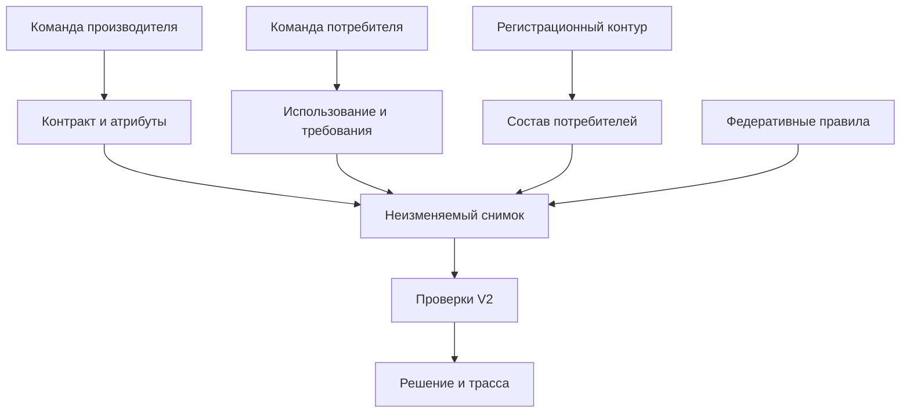

# Карта знаний и контур решений V2

Версия knowledge-1, 29.09.2026. Реализован исследовательский модуль с версионированным журналом, снимками, V2, CLI и API. Полнота относится к объявленной границе зарегистрированных потребителей. Межпроцессный E4 ещё не проведён.

## Для чего нужна карта

Карта связывает изменение определения продукта с командами, использующими его атрибуты, их расчётами и обязательными требованиями. Она отвечает на четыре вопроса: кто затронут; какие ограничения нужно проверить; достаточно ли подтверждённых данных; почему выпуск разрешён, отклонён или передан на разбор. Общий индекс обеспечивает поиск, а полномочия на изменение знания остаются у доменов.

Объект исследования - управление кросс-платформенными метаданными в событийной архитектуре Data Mesh. Предмет - механизм фиксации подтверждённого контекста потребления и проверки изменения бизнес-семантики до выпуска. Карта обеспечивает вход и происхождение требований; типизированный интерпретатор проверяет совместимость; финализация разрешает выпуск только при достаточном контексте. Наличие карты само по себе не доказывает новизну или преимущество H1.



## Сущности и связи

Каждая запись имеет стабильный record_id, последовательный version, owner_domain, status, confirmed_by, evidence_ref и интервал действия. Подтверждение и отзыв добавляют версии, а не переписывают предыдущие.

| Сущность | Что хранится | Обязательная связь / проверка | Полномочие |
| --- | --- | --- | --- |
| Team | Команда, домен, ссылка на полномочие | domain_id совпадает с владельцем; grant задан конфигурацией | Владелец домена |
| Product | Продукт, команда производителя, полный текущий контракт | Команда и owner_domain согласованы; старый контракт снимка совпадает с подтверждённым | Производитель |
| Attribute | Путь поля, версия контракта, источник семантического профиля | Поле существует в старом контракте и относится к его версии | Производитель |
| Usage | Потребитель, команда, поля, назначение, зависимый расчёт, источник регистрации, active | Команда относится к домену; используемые поля представлены в карте | Потребитель |
| Obligation | Ссылка на Usage, типизированное требование и признак обязательности | Потребитель, домен и продукт согласованы; конфликтующие ID блокируют допуск | Потребитель |
| Coverage | Продукт, membership_epoch, зарегистрированные участники, граница и источник регистрации | Единственный подтверждённый реестр; его состав совпадает с активными Usage | Уполномоченный регистрационный контур |
| GlobalRule | Федеративное обязательное ограничение, версия, priority | Продукт согласован; конфликтующие ID требуют разбора | Федеративная функция |
| Constitution | Версия и хеш конституции, источник | Однозначная действующая запись; изменение блокирует старый запуск | Федеративная функция |
| Snapshot | Контракты до/после, версии записей, хеши, состав, полнота и проблемы | Канонический SHA-256; привязка к журналу | Строится алгоритмом, не утверждает бизнес-смысл |
| Release | proposal/run/snapshot, проверки, причины, состояние и release_id | Повтор run с тем же входом идемпотентен; иной вход запрещён | Финализация V2 |

Один потребитель может иметь несколько обязательных требований с разными obligation_id. Все они проверяются. Priority сохраняется как метаданные, но автоматическое вытеснение обязательного правила не реализовано: повтор одного rule_id консервативно требует разбора. Нельзя объявить обязательное правило необязательным через выбор удобного приоритета.

Семантический профиль текущего ядра относится к продукту целиком; поля карты уточняют использование и трассу. Для отдельных неодинаковых профилей каждого поля потребуется расширение модели и новая версия протокола. calculation_ref и semantic_profile_ref являются ссылками на внешнее свидетельство; модуль не исполняет расчёт и не доказывает содержание документа по одной ссылке.

## Жизненный цикл и полномочия

1. Владелец или настроенный доменный помощник предлагает candidate с источником.
2. Уполномоченная команда подтверждает запись; отдельная новая версия получает confirmed_by и evidence_ref.
3. Регистрационный контур подтверждает Coverage в явно заданной границе.
4. Производитель предлагает изменение; алгоритм фиксирует версии на as_of и проверяет связи и полноту.
5. V2 проверяет действующие обязательные требования и федеративные ограничения. UNKNOWN не означает согласие.
6. Перед COMMITTED под одной блокировкой повторно проверяются версии и сроки. Изменение или истечение записи даёт ABORTED без release_id.
7. Недостающие сведения дополняются новыми версиями; повторная проверка использует новый snapshot/run. Старый снимок остаётся воспроизводимым.

Authority - доверенная конфигурация развёртывания. Запись с собственным authority_ref не выдаёт себе полномочий. API связывает bearer token с actor на стороне сервиса; actor не принимается из тела запроса. Общая чтение карты предназначено для подключённых команд; разграничение видимости секретных метаданных по продуктам пока не реализовано. Записи не содержат пользовательские события или персональные данные.

## Достаточность контекста

| Проверка | Данные | При проблеме |
| --- | --- | --- |
| Граница регистрации известна | Подтверждённый Coverage и membership_epoch | unknown/incomplete, NEEDS_REVIEW |
| Контракт принадлежит производителю | Product, Team, authority grant | Допуск невозможен |
| Все участники представлены | Coverage и активные Usage | NEEDS_REVIEW |
| Для каждого участника есть обязательства | Usage и одно или несколько Obligation | NEEDS_REVIEW |
| Используемые атрибуты согласованы | Attribute, поля и версия старого контракта | NEEDS_REVIEW |
| Записи действуют | confirmed, valid_from/valid_until, отсутствие отзыва | NEEDS_REVIEW; изменение после снимка - ABORTED |
| Версии и ссылки однозначны | ID, версии, Usage/Team, правила и конституция | NEEDS_REVIEW |
| Контекст не изменился перед выпуском | Повторное сравнение выбранных хешей и полноты | ABORTED |
| Все действительные проверки положительны | Семантические и структурные CheckResult | ACCEPT только при complete |
| Есть доказанное действительное нарушение | FALSE с требованием и свидетельством | REJECT, даже если иной контекст требует дополнения |

Подтверждённый пустой состав отличается от отсутствующего Coverage. Новая candidate-версия консервативно закрывает допуск до подтверждения; прежняя версия остаётся доступной в историческом снимке. Перенос владельца через обычное обновление запрещён и требует отдельного миграционного протокола.

## Операции и воспроизведение

Основные файлы: `knowledge.py`, `knowledge_release.py`, `knowledge_cli.py`, `knowledge_api.py` в `src/datamesh_release_protocol`.

| Операция | Вход | Выход |
| --- | --- | --- |
| propose_record | Типизированная запись, actor, время | Новая candidate-версия и событие |
| confirm_record / revoke_record | ID, actor, источник, время | Новая версия и событие |
| list_impact | Продукт, изменяемые поля, as_of | Использования и связанные требования с их статусами |
| build_snapshot | Предложение, старый/новый контракты, as_of | Неизменяемый снимок; полнота и конкретные issues |
| resolve_snapshot | snapshot_id | Проверенная копия прежнего снимка |
| KnowledgeReleaseEngine.run | snapshot_id, run_id, время, миграции | Решение, состояние, release_id и доказательства |
| producer_view / consumer_view | Решение; при необходимости consumer_id | Затронутые требования, поля, причины и источники |

```sh
PYTHONPATH=src:. python examples/knowledge/demo.py
PYTHONPATH=src python -m datamesh_release_protocol.knowledge_cli --help
PYTHONPATH=src python -m datamesh_release_protocol.knowledge_cli \
  --authorities examples/knowledge/authorities.json --ledger /tmp/knowledge-ledger.json \
  impact --product active-users --fields active --at 2026-09-29T00:00:02Z
```

Для CLI сначала скопируйте `examples/knowledge/ledger.json` в выбранный ledger. Пример синтетический; не содержит эталонных ответов каталога. API создаётся через `create_knowledge_app(store, token_actors)`, зависимости - `pip install -e '.[api,test-api]'`. Токены задаются оператором вне репозитория. Записи API получают серверное время; историческое as_of доступно только для чтения/CLI.

Хранилище - типизированный JSON-журнал с атомарной заменой файла, цепочкой хешей событий и проверкой восстановления. Снимки сохраняются в том же файле. Один процесс записи на файл; lock защищает текущий процесс. Хеши выявляют нарушение целостности, но не заменяют защищённое хранение, подписи или проверку истинности сведений. Разрешение выпуска ещё не является публикацией продукта. В пакете 1 реализованы устойчивый журнал разрешений, восстановление после перезапуска и подтверждения публикации; внешний получатель должен дедуплицировать release_id. См. [границы гарантий пакета 1](package-1-reliability-2026-09-29.md).

`ReleaseEngine` и `/release-check` остаются экспериментальным ядром на готовых сценариях. Полный путь карты использует `KnowledgeReleaseEngine` и отдельную фабрику API. Их нельзя выдавать за одинаковый уровень доказанной полноты. Основной E3 использует фиксированные полные требования; негативные проверки карты анализируются отдельно.

## Проверено и что требуется дальше

Проверены допуск совместимого изменения, отклонение нарушения семантики/схемы, candidate/expired/revoked, отсутствующие атрибуты и связи, несогласованный реестр, конфликт ID, федеративный запрет, историческое чтение, неизменность копий, порча журнала/снимка, идемпотентность run, отзыв и истечение перед commit, аутентификация и чужие полномочия в API.

Следующие обязательные результаты: пилот анкеты на реальных специалистах; согласованная разметка и freeze; решение с научруком по достижимости строгого H1; E3 после freeze; межпроцессный E4 по 12 классам из C/D. До этого нельзя утверждать поддержку H1/H3 или считать число повторов числом независимых наблюдений.

Итог проверки текущей пачки: 82 unittest-теста, 10 structural evaluation-check и headless smoke анкеты прошли. В отчёт метрик добавлены admissible_reject_rate, admissible_review_rate и dangerous_review_rate; прежний false_block_rate и строгие пороги сохранены.

## Пакет 1 выполнен

[Отчёт ревизии и восстановления](package-1-reliability-2026-09-29.md): knowledge-ledger-2 сохраняет решения и подтверждения, исключает второе разрешение того же изменения и конфликт содержимого целевой версии, повторно вычисляет решения при загрузке. Ошибка сохранения закрывает допуск до reload; устаревший писатель не перезаписывает чужие изменения. ALREADY_COMMITTED - состояние повторного запуска, не новый enum решения. Текущий набор: 105 тестов пройдены; E3/E4 не выполнены.
